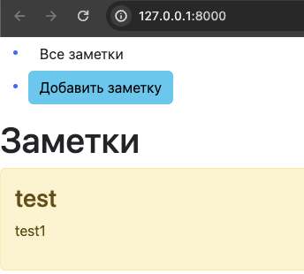

# django_proj

> [!IMPORTANT]
> Подготовка окружения для запуска проекта
- `$ python -m venv venv_name`  *создаем новое окружение
- `$ source venv_name/bin/activate` *активируем
- `$ pip install -r requirements.txt` *устанавливаем зависимости
- `$ python manage.py runserver` *запускаем

> [!TIP]
> по умолчанию приложение запустится на 8000 порту 

